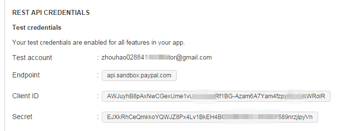
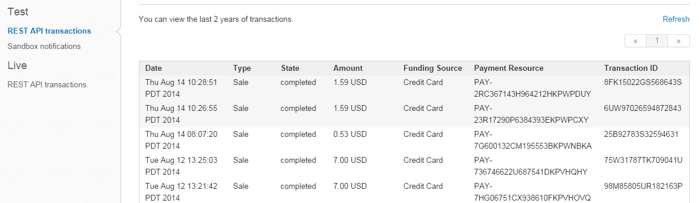
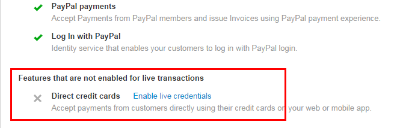

Paypal-jfinal
=============
This is a very simple demo[SDK] for PayPal with **Credit Card Payment Only**.   
[[jFinal](https://github.com/jfinal/jfinal) is a light, powerful Java framework]

<h3>How to setup?</h3>
1. Get a PayPal Account   
2. Create an App in https://developer.paypal.com/, then you can get `REST API CREDENTIALS`    
3. Update [`sdk_config.properties`](src/main/resources/sdk_config.properties)

<h3>Support Credit Card Types</h3>
must be visa, mastercard, amex, or discover

<h3>Unit Test</h3>
I provide a usage demo in [Unit test](src/main/java/me/hzhou/paypal/test/UnitTest.java)
```
	@Test
	public void paymentTest() {
		PayPal paypal = new PayPal();
		paypal.setBillAddress("52 N Main ST", "Johnstown", "US", "OH", "43210");
		
		// Never mind, this is a fake information from PayPal Developer Center
		// sorry
		paypal.setCreditCard("4417119669820331", "visa", 11, 2018, "874", "Joe", "Shopper");
		
		// 1.50 doesn't include tax
		paypal.setAmount(1.50);
		
		// output details as
		/*{
		  "shipping": "0",
		  "subtotal": "1.50",
		  "tax": "0.09"
		}
		*/
		System.out.println(paypal.getDetails().toJSON());
		
		Payment payment = paypal.pay();
		System.out.println(payment.toJSON());
		
	}
```

Issues:
====
1. You may not eligible for Accepting payments from customers directly using their credit cards on your web or mobile app in prodcution [Direct credit cards].
```
{
	"name":"UNAUTHORIZED_PAYMENT",
	"message":"Unauthorized payment",
	"information_link":"https://developer.paypal.com/webapps/developer/docs/api/#UNAUTHORIZED_PAYMENT",
	"debug_id":"XXXXXXXX"
}
```
